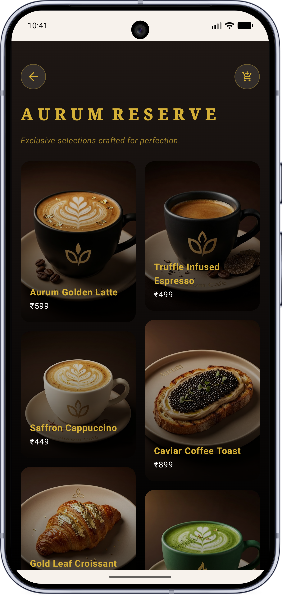
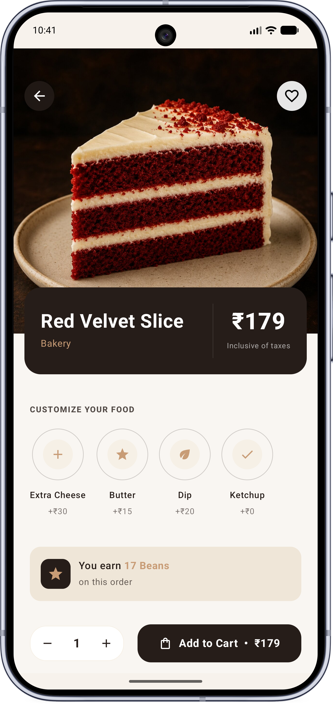
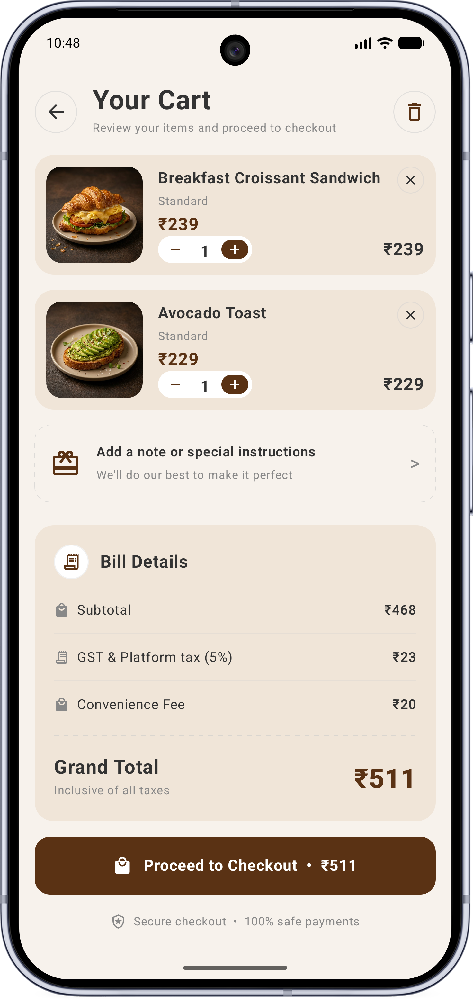
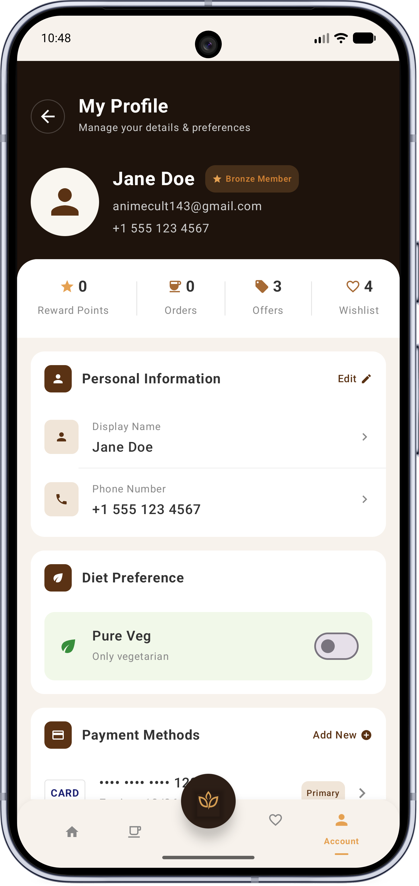
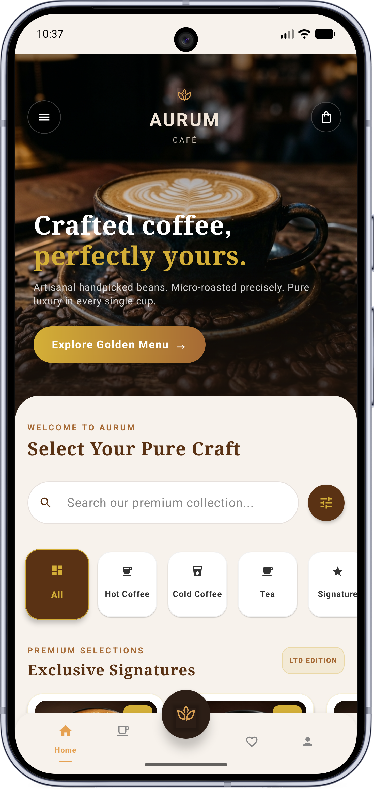
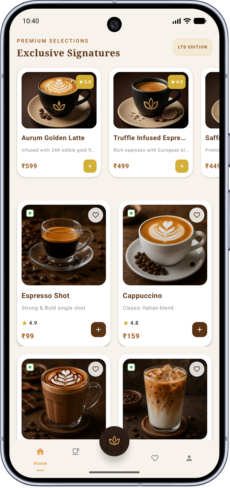
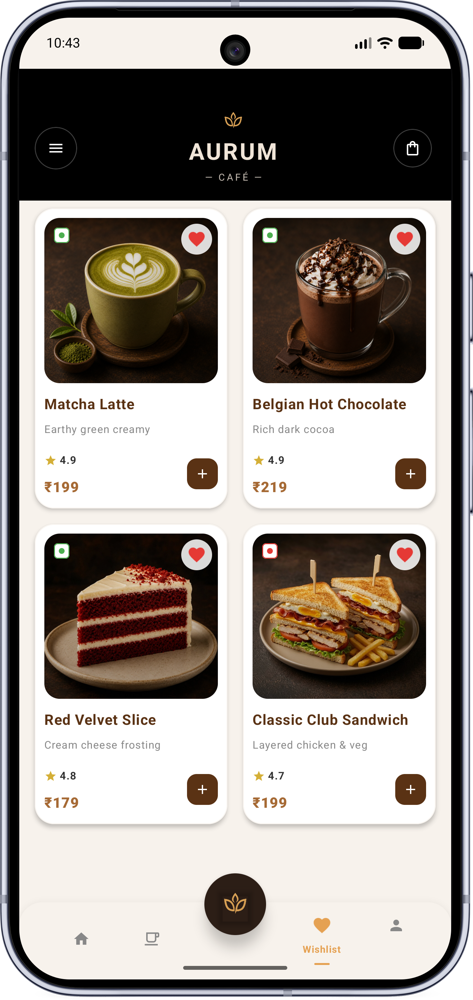
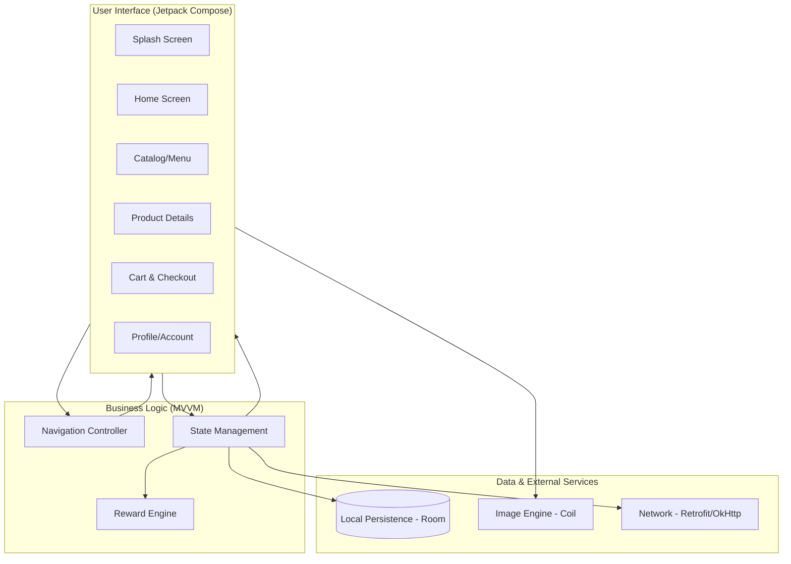
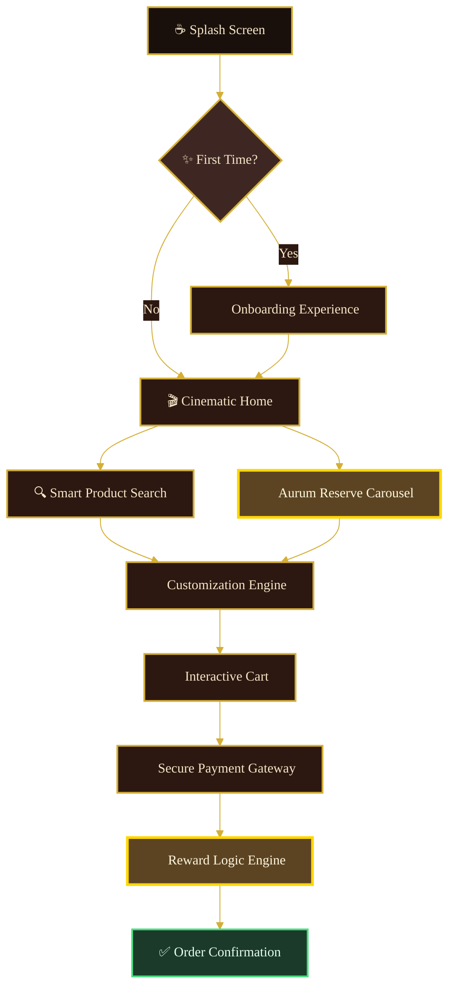
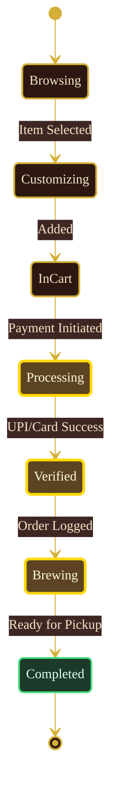

<div align="center">


<br/>

# ⚜️ AURUM CAFÉ ⚜️
### *The Gold Standard of Digital Coffee Craftsmanship*

<br/>

[](https://www.android.com/)
[](https://kotlinlang.org/)
[](https://developer.android.com/jetpack/compose)
[](https://github.com/)
[](https://github.com/)

<br/>

> **Aurum Café** is a luxury mobile sanctuary designed for the true coffee connoisseur. By bridging artisanal heritage with high-performance modern engineering, we deliver a cinematic experience that transforms a daily routine into a high-end ritual.

<br/>

**[✨ Features](#-key-features)**  •  **[📂 Structure](#-project-architecture)**  •  **[📊 Diagrams](#-logic--workflow-diagrams)**  •  **[🏗 Technical](#-technical-blueprint)**  •  **[📈 Metrics](#-performance--metrics)**  •  **[🚀 Setup](#-getting-started)**  •  **[🗺 Roadmap](#-future-roadmap-v20)**

<br/>

╔═══════════════════════════════════════════════════════════╗

</div>

## ✨ Key Features

<table>
<tr>
<td width="50%" valign="top">

### 🏆 The Aurum Reserve
*Signature Collection*

An exclusive category for elite members. Features ultra-premium items like **24-Karat Gold-Infused Lattes** and **Black Truffle Espressos** with custom cinematic detail screens.



</td>
<td width="50%" valign="top">

### 🎨 Advanced Customization
*Granular Brew Control*

A granular modification system allowing users to adjust every aspect of their brew:
- **Roast Profiles** — Light to Dark French roasts
- **Artisanal Milks** — Oat, Almond, Jersey, Soy
- **Topping Precision** — Gold flakes, micro-foams



</td>
</tr>
<tr>
<td width="50%" valign="top">

### 💳 Multi-Gateway Payment
*Secure Checkout Flow*

A secure, PCI-compliant inspired checkout flow supporting:
- **Digital Wallets** — Paytm, PhonePe, GPay
- **Direct UPI** — Deep-linking
- **Saved Cards** — Encrypted UI



</td>
<td width="50%" valign="top">

### 💎 Dynamic Tier Rewards
*Loyalty That Pays*

A logic-driven loyalty system where users earn **Aurum Beans** (10% of order value) and progress through membership tiers.



</td>
</tr>
</table>

<div align="center">

╚═══════════════════════════════════════════════════════════╝

</div>

---

## 📱 App Experience

<div align="center">
  <table border="0">
    <tr>
      <td align="center"><b>Cinematic Home</b></td>
      <td align="center"><b>Curated Menu</b></td>
      <td align="center"><b>Premium Wishlist</b></td>
    </tr>
    <tr>
      <td></td>
      <td></td>
      <td></td>
    </tr>
  </table>
</div>

---

## 📂 Project Architecture

The project follows a modified **Clean Architecture** pattern with **MVVM**, ensuring high scalability, testability, and a clear separation of concerns.

### 🌳 Visual File Tree

```text
aurum-cafe-main/
├── app/
│   ├── src/main/java/com/example/
│   │   ├── MainActivity.kt        # Root Entry Point, NavHost, & Compose Logic
│   │   ├── ui/                    # UI Design System
│   │   │   ├── theme/             # Color Palettes (Espresso/Gold/Beige)
│   ├── src/main/res/
│   │   ├── drawable/              # 4K High-res Product Photography
│   │   ├── values/                # Internationalization & String Resources
├── gradle/                        # Build Automation Configuration
├── build.gradle.kts               # Root Project Configuration
├── settings.gradle.kts            # Module Definition
└── local.properties               # SDK & Environment Configuration
```

---

## 📊 Logic & Workflow Diagrams

### 🏗 System Block Diagram


### 🗺 User Journey Flow



<div align="center">

<sub>🥇 <b>Gold-bordered nodes</b> mark premium, revenue-critical touchpoints in the journey</sub>

</div>

<br/>

### ☕ Order Processing Lifecycle



<div align="center">

<sub>💳 <b>Gold states</b> represent the secure transaction core — from payment intent to brewing</sub>

</div>

---

## 🏗 Technical Blueprint

<div align="center">

| 🧩 Feature | ⚙️ Implementation Detail | 🎯 Advantage |
| :--- | :--- | :--- |
| **UI Framework** | Jetpack Compose (Material 3) | Declarative, modern, and rapid UI development. |
| **State Management** | `mutableStateOf` & `remember` | Scoped lifecycle management for fluid interactions. |
| **Image Pipeline** | **Coil** (Coroutines-based) | Memory-efficient, async loading with downsampling. |
| **Navigation** | **Compose Navigation** (Type-Safe) | Robust route management and argument passing. |
| **Haptics** | `LocalHapticFeedback` | Tactile confirmation on premium interactions. |
| **Persistence** | **Room Database** | Offline-ready local storage for cart and history. |
| **Networking** | **Retrofit + OkHttp** | Scalable API communication with interceptors. |
| **Serialization** | **Moshi** | Modern JSON parsing for Kotlin data classes. |

</div>

---

## 📈 Performance & Metrics

<div align="center">

We prioritize a flawless, butter-smooth user experience.

| ⚡ Startup Speed | 🎞️ Rendering | 🧠 Memory | 🔋 Battery | 📦 Binary Size |
| :---: | :---: | :---: | :---: | :---: |
| **~1.2s** | **60 FPS** | **< 180MB** | **Low-power** | **~12MB** |
| optimized asset loading | constant on modern hardware | during catalog browsing | background processing | optimized via R8/Proguard |

</div>

---

## 🛡️ Security & Reliability

- 🔒 **ProGuard/R8** — Obfuscation and code shrinking for IP protection.
- 📱 **Edge-to-Edge** — Full screen immersion on Android 10+ devices.
- 🤚 **Haptic Feedback** — Integrated into the "Add to Cart" and "Category Select" flows for a tactile, physical feel.
- 📐 **Responsive Design** — Dynamic layouts that adapt to various screen ratios and sizes.

---

## 🛠 Future Roadmap (v2.0)

- [ ] **Live Order Tracking** — Real-time GPS and map integration.
- [ ] **AR Preview** — Visualize your coffee art in 3D using ARCore.
- [ ] **Dark Mode** — High-contrast "Midnight Blend" premium theme.
- [ ] **Voice Ordering** — Hands-free selection for the on-the-go user.
- [ ] **Multilingual Support** — French, Italian, and Spanish localizations.

---

## 🚀 Getting Started

### 📋 Prerequisites

| Requirement | Version |
| :--- | :--- |
| **Android Studio** | Ladybug \| 2024.2.1 or newer |
| **Gradle** | 9.0+ |
| **JDK** | 17 or 21 (LTS recommended) |

### 🛠 Installation

**1. Clone the Repo**
```bash
git clone https://github.com/Ashitosh2004/aurum-cafe.git
```

**2. Gradle Sync**
Open the project in Android Studio and let the dependencies download.

**3. Deploy**
Select `Build > Make Project` and run on your target device.

---

<div align="center">

### ☕ *"Crafting More Than Just Coffee"*

<sub>© 2026 Aurum Café. All Rights Reserved.</sub>
<br/>
<sub><i>Crafted with precision, passion, and the finest beans in the digital world.</i></sub>

<br/><br/>

⚜️ **AURUM CAFÉ** ⚜️

</div>
